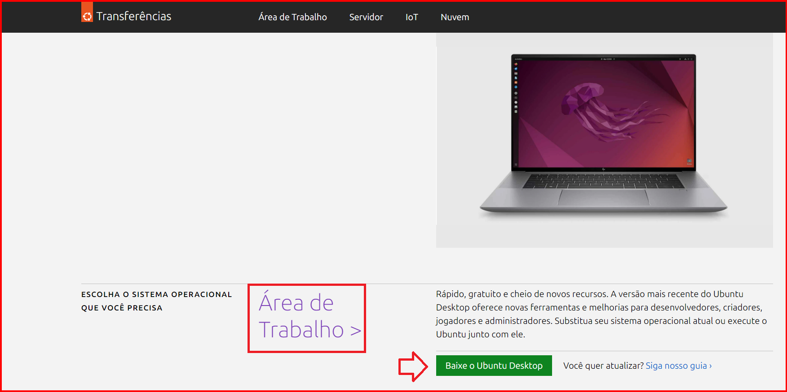
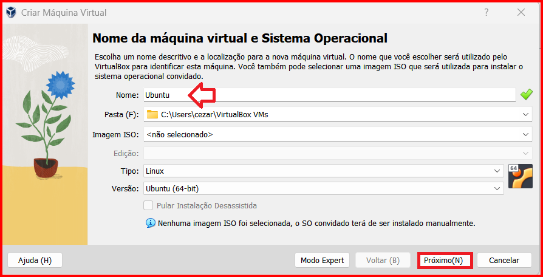
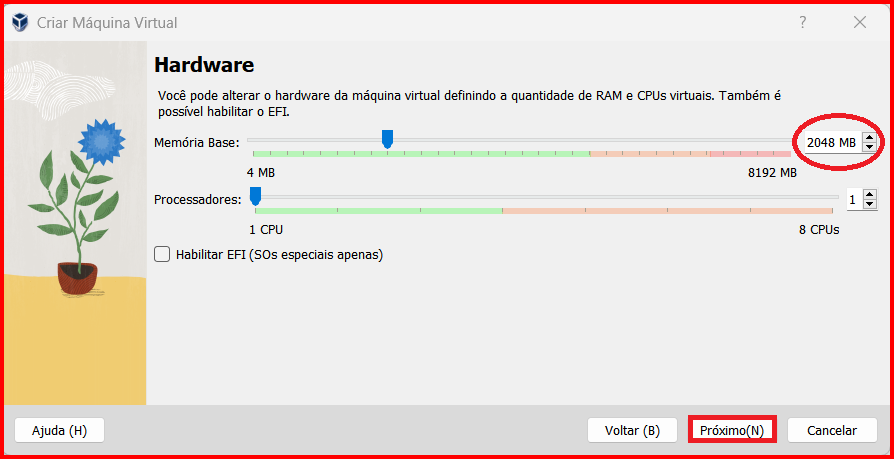
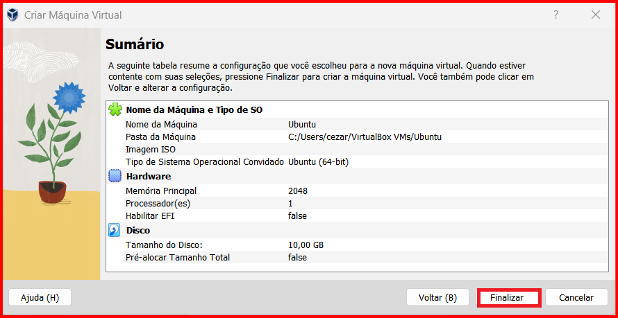
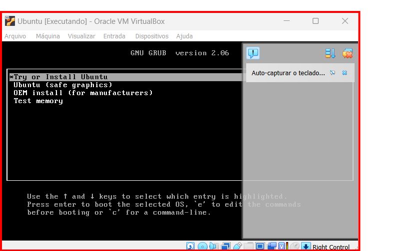
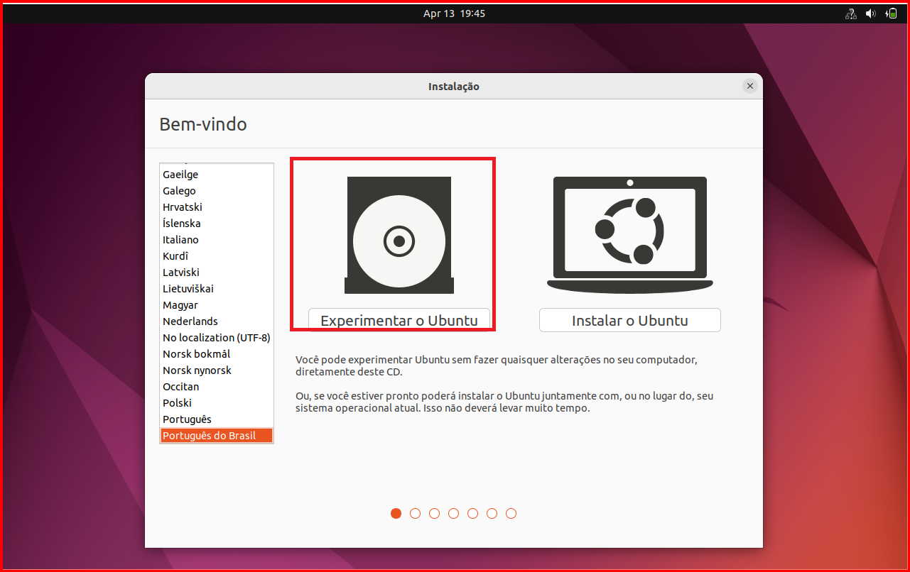
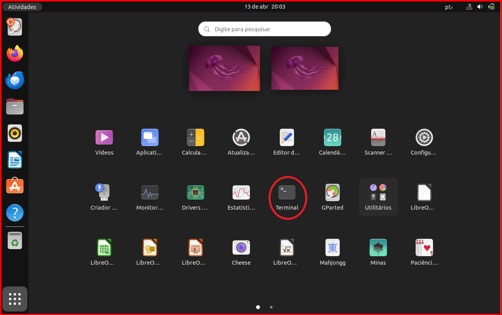
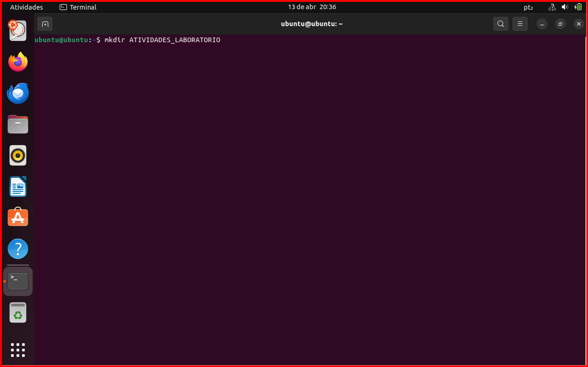
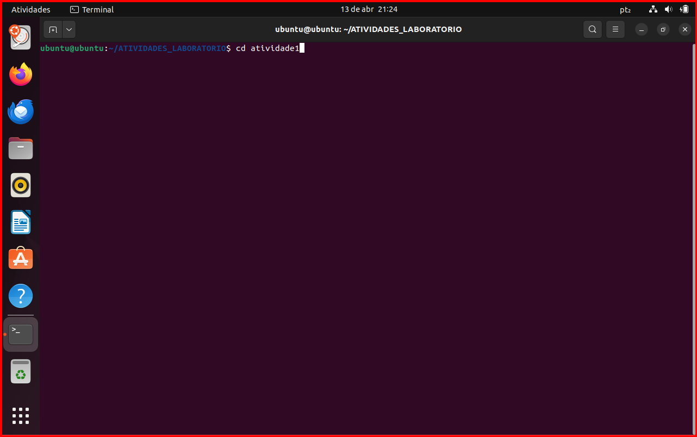

## sistemas-operacionais-linux
# Sistemas Operacionais: Práticas em GNU/Linux (Ubuntu)

Este repositório documenta as atividades práticas realizadas na disciplina de Sistemas Operacionais, focadas na configuração de ambientes virtualizados e domínio da linha de comandos (CLI) Linux.

## 🎯 Objetivos do Projeto
* Implementar a virtualização de sistemas operativos com o **Oracle VM VirtualBox**.
* Dominar comandos fundamentais do terminal para gestão de ficheiros e diretórios.
* Compreender a estrutura de diretórios e permissões do Linux (Ubuntu).

## 🛠️ Ambiente Técnico
* **Host:** Windows 10/11
* **Guest (VM):** Ubuntu Linux
* **Software:** VirtualBox

## 💻 Atividades Realizadas

### 1. Configuração de Máquina Virtual
Instalação do Ubuntu Linux em ambiente virtual para testes de infraestrutura sem impacto no sistema anfitrião.

.png)

### 2. Manipulação de Diretórios e Ficheiros
Criação de uma estrutura organizada de pastas para simular um ambiente de laboratório.
* Comandos utilizados: `mkdir`, `cd`, `ls -l`.

**Estrutura de pastas criada:**

### 3. Criação de Conteúdo via Terminal
Utilização do comando `cat >` para criação do ficheiro `disciplinas_semestre` e verificação do conteúdo.

### ## 🛠️ Documentação Técnica dos Comandos

Para a execução das atividades práticas no terminal **Bash (Linux)**, foram utilizados comandos fundamentais de manipulação de sistema de arquivos. Abaixo, detalho a aplicação técnica de cada um conforme realizado no projeto:

### 📂 mkdir (Make Directory)
* **Descrição Técnica:** Comando utilizado para criar novos diretórios (pastas) no sistema.
* **Aplicação no Projeto:** Foi essencial para organizar o ambiente de trabalho, permitindo a criação da pasta raiz `ATIVIDADES_LABORATORIO` e da subpasta específica `atividade1`.
* **Exemplo:** `mkdir ATIVIDADES_LABORATORIO`

### 🧭 cd (Change Directory)
* **Descrição Técnica:** Comando utilizado para navegar entre os diretórios do sistema, alterando o diretório de trabalho atual.
* **Aplicação no Projeto:** Utilizado para entrar nas pastas recém-criadas e garantir que os comandos seguintes (como a criação de arquivos) fossem executados no local correto.
* **Exemplo:** `cd atividade1`

### 🔍 ls / dir (List)
* **Descrição Técnica:** O comando `ls` (list) é o padrão no Linux para listar arquivos e pastas. No contexto do trabalho, ele funciona para visualizar o conteúdo do diretório atual.
* **Aplicação no Projeto:** Utilizado para validar se as pastas e o arquivo `disciplinas_semestre` foram criados com sucesso, confirmando a estrutura proposta pelo roteiro.
* **Exemplo:** `ls -l`

### 📄 cat (Concatenate and Display)
* **Descrição Técnica:** Um utilitário versátil usado para criar, visualizar e concatenar arquivos de texto.
* **Aplicação no Projeto:** * **Criação:** Utilizado o redirecionador `cat > disciplinas_semestre` para inserir a lista de matérias diretamente via terminal.
    * **Visualização:** Utilizado o comando simples `cat disciplinas_semestre` para exibir o conteúdo no terminal e validar a integridade dos dados inseridos.

---
## 📂 Conteúdo Adicional
O relatório académico completo, com a fundamentação teórica e as conclusões, pode ser consultado na pasta `/documentos`.
