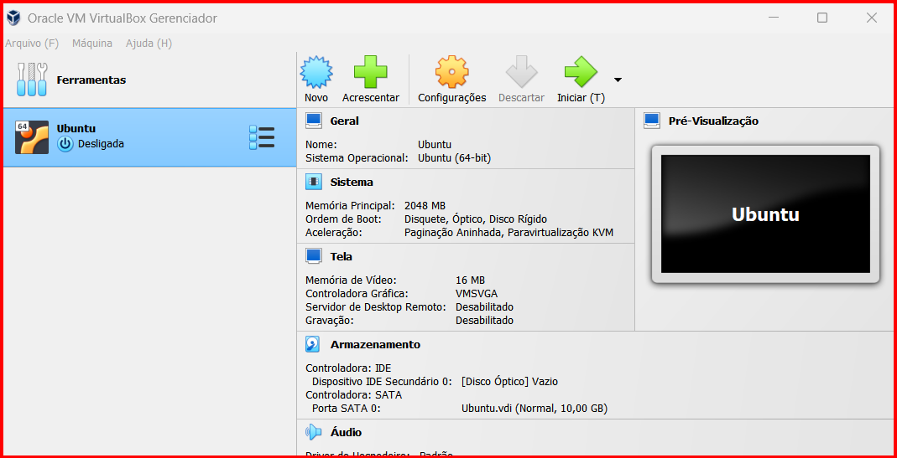

## sistemas-operacionais-linux
# Sistemas Operacionais: Práticas em GNU/Linux (Ubuntu)

Este repositório documenta as atividades práticas realizadas na disciplina de Sistemas Operacionais, focadas na configuração de ambientes virtualizados e domínio da linha de comandos (CLI) Linux.

## 🎯 Objetivos do Projeto
* Implementar a virtualização de sistemas operativos com o **Oracle VM VirtualBox**.
* Dominar comandos fundamentais do terminal para gestão de ficheiros e diretórios.
* Compreender a estrutura de diretórios e permissões do Linux (Ubuntu).

## 🛠️ Ambiente Técnico
* **Host:** Windows 10/11
* **Guest (VM):** Ubuntu Linux
* **Software:** VirtualBox

## 💻 Atividades Realizadas

### 1. Configuração de Máquina Virtual
Instalação do Ubuntu Linux em ambiente virtual para testes de infraestrutura sem impacto no sistema anfitrião.

.png)
 

### 2. Manipulação de Diretórios e Ficheiros
Criação de uma estrutura organizada de pastas para simular um ambiente de laboratório.
* Comandos utilizados: `mkdir`, `cd`, `ls -l`.

**Estrutura de pastas criada:**

### 3. Criação de Conteúdo via Terminal
Utilização do comando `cat >` para criação do ficheiro `disciplinas_semestre` e verificação do conteúdo.

## 📂 Conteúdo Adicional
O relatório académico completo, com a fundamentação teórica e as conclusões, pode ser consultado na pasta `/documentos`.
